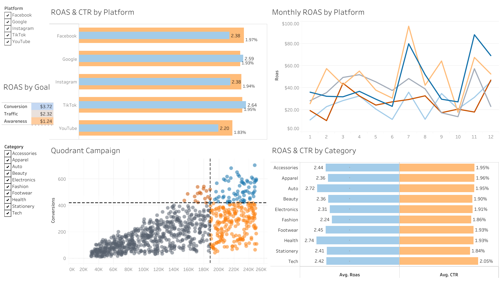

# 📊 Paid Media Performance Dashboard

## 📌 Introduction
This Tableau dashboard presents a detailed view of paid media performance across various digital platforms and advertising goals throughout 2024. It allows marketing teams and business stakeholders to identify top-performing channels, compare campaign efficiency, and derive actionable insights based on both engagement and return on ad spend (ROAS).

The dashboard supports interactive filtering by platform, category, and campaign goal, and includes a dynamic quadrant chart for campaign-level benchmarking.

---

## 🧾 Project Background
- **Data Source**: Simulated performance data representing realistic advertising patterns for a small-to-mid-size business.
- **Timeframe**: January 1, 2024 – December 31, 2024
- **Rows**: 900 unique ad campaign records
- **Data Dimensions**:
  - `Ad Name`: Concatenated field of platform, campaign, category, and goal (e.g., `Facebook_BackToSchool_Health_Conversion_1`)
  - `Date`: Campaign-level timestamp
  - `Platform`, `Category`, `Goal`
- **Metrics**:
  - `Impressions`, `Clicks`, `CTR (%)`, `CPC ($)`
  - `Conversions`, `CVR (%)`, `Spend ($)`, `Revenue ($)`, `ROAS`

---

## 🔍 Main Insights

### 1. **Platform Performance**
- **Google** and **TikTok** show the highest ROAS among platforms (~2.59 and 2.64 respectively), while **YouTube** trails with a lower ROAS of ~2.20.
- CTR is relatively consistent across platforms (~1.83–1.97%), suggesting ad design or placement consistency.

### 2. **Goal-Based Efficiency**
- **Conversion campaigns** significantly outperform others with a ROAS of **$3.72**, confirming they deliver the best returns per dollar spent.
- **Awareness campaigns** produce the lowest ROAS (~$1.24), highlighting a trade-off between brand visibility and cost efficiency.

### 3. **Monthly ROAS Trends**
- Seasonal peaks in ROAS are visible in **July** and **November** for Google and Facebook, likely due to summer promotions and holiday campaigns.
- Among social media platforms (Facebook, Tiktok, Instagram), for the first two quarters of the year, Instagram outperformed the other two platform and contribute to the most ROAS whereas in the last two quarters, Facebook plays a more major role.

### 4. **Category Analysis**
- Categories like **Health** and **Auto** show higher ROAS (2.74 and 2.72 respectively), making them strong candidates for further investment.
- **Tech** has the highest CTR (2.05%), indicating high engagement even if ROAS is moderate.

### 5. **Quadrant Chart (Campaign Benchmarking)**
- Campaigns are plotted using **Impressions (X-axis)** and **Conversions (Y-axis)**.
- The chart allows users to dynamically center the view by clicking any campaign (set action), enabling relative comparison:
  - **Top-right quadrant**: High impressions & high conversions — ideal campaigns.
  - **Bottom-left**: Low reach & impact — candidates for pause or redesign.

---

## 🧠 Suggestions

### 📈 Strategic Recommendations:
1. **Reallocate Budget** toward **Conversion-focused** campaigns, especially on Google and TikTok.
2. **Experiment with Scaling** Auto and Health category campaigns — strong ROAS and CTR performance.
3. **Optimize Awareness Campaigns** by refining targeting or creative, or consider reallocating budget if performance stays weak.
4. **Plan for Seasonal Spikes** in July and November by increasing spend and diversifying creatives ahead of time for Google and Facebook.

### 📊 Dashboard Improvements (Future Work):
- Add filters for **goal type** within the quadrant chart.
- Include **CPA (Cost Per Acquisition)** for deeper efficiency tracking.
- Layer in actual campaign names or creatives for qualitative review.

---

## 👩‍💻 Built by
**Jiayuan (Irene) Shi**  
Contact: [LinkedIn](https://www.linkedin.com/in/jiayuanshi/) 
